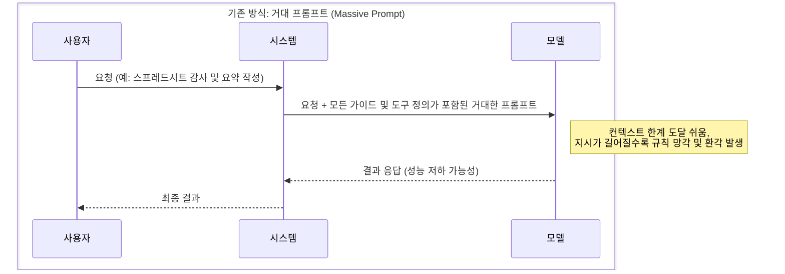
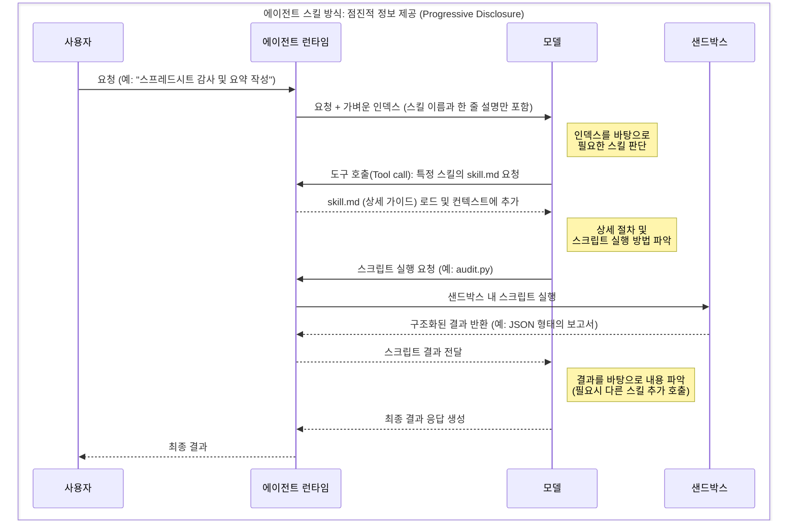

# AI 에이전트 설계: 자아(Persona) 구축과 도구(Action)의 효율적 관리

## 1. 자아의 탄생 (Identity): "누구인가를 결정하는 법"

* **발생한 문제:** 범용 LLM은 전문적인 태도가 부족하고 답변의 일관성이 떨어짐.
* **해결책: 시스템 프롬프트(System Prompt)** [^1]
    * 모델에게 '시니어 개발자'나 '분석가' 같은 **페르소나**를 부여.
    * **핵심:** 페르소나는 단순한 말투 설정을 넘어, AI의 **의사결정 우선순위와 전문적 판단 기준**을 세우는 핵심 기반임.

## 2. 도구의 장착 (Action): "말뿐인 지능에서 실행하는 에이전트로"

* **발생한 문제:** 자아가 생겼지만, 실시간 데이터 접근이나 파일 생성 등 실제 업무를 '수행'하지 못함.
* **해결책: Function Calling & MCP (표준 규격)**
    * **Function Calling:** AI에게 손과 발(API 호출 능력)을 달아줌. OpenAI가 2023년 6월 GPT-3.5 Turbo와 GPT-4에 처음 도입함. [^2]
    * **MCP (표준화):** Anthropic이 2024년 11월 오픈소스로 공개한 프로토콜로, 도구들을 USB처럼 어디든 꽂아 쓸 수 있게 규격화하여 재사용성을 극대화함. [^3] 2025년 12월에는 Linux Foundation 산하 Agentic AI Foundation에 기부되어 OpenAI, Google, Microsoft, AWS 등이 공동 지원하는 업계 표준이 됨. [^4]
* **역사적 포인트:** Function Calling(2023)의 보급이 에이전트 활용의 결정적 전환점이 되면서, '대화만 하는 AI'에서 '실행하는 AI'로의 인식 전환이 일어남.

## 3. 관리의 위기: "능력이 많아질수록 멍청해지는 역설"

* **발생한 문제:** 페르소나 지침과 수많은 도구 사용법을 시스템 프롬프트에 한꺼번에 넣자 **세 가지 한계**가 발생함.
    1. **비용 폭발:** 매 대화마다 방대한 지침을 전송하여 토큰 비용 급증. 도구가 많아지면 토큰 오버헤드가 98% 이상 발생할 수 있음. [^5]
    2. **지능 저하:** 읽어야 할 지침이 너무 길면 모델이 정작 중요한 질문에 집중하지 못함. Stanford·UC Berkeley 연구에 따르면, 컨텍스트가 길어질수록 중간에 위치한 정보를 놓치는 "Lost in the Middle" 현상이 발생함. [^6]
    3. **유지보수 지옥:** 작은 규칙 하나 고치려다 거대한 프롬프트 전체를 망가뜨릴 위험.

## 4. 효율적 관리의 완성: "모듈화와 지능적 조립"

* **해결책 1: 파일 기반 모듈화 (.md)**
    * 하나의 거대한 프롬프트 대신, 역할별로 독립된 마크다운 파일로 분리하는 설계 패턴이 업계에서 수렴적으로 채택되고 있음.
    * **AGENTS.md:** 정체성과 작업 원칙만 별도로 분리하여 관리. OpenAI, Google, Cursor 등이 공동 표준화한 오픈 포맷임. [^7]
    * **Skill.md:** Function Call이나 MCP 도구의 **설명서**를 개별 파일로 독립시켜 필요할 때만 참조하게 함. [^8]
    * **USER.md:** 사용자의 배경과 선호도를 저장해 개인화된 대응 가능케 함. [^9]
* **해결책 2: 에이전트 런타임(Agent Runtime)의 동적 스킬 선택** [^10]
    * **LLM 기반 동적 선택:** 에이전트 런타임이 사용 가능한 스킬 목록(이름과 간단한 설명)을 프롬프트에 포함하여 LLM을 호출하면, LLM이 사용자의 질문에 필요한 스킬을 **스스로 판단하여 선택**함. 런타임은 이 선택을 받아 해당 Skill.md를 로딩함. 이것이 Function Calling과 Tool Use의 기본 작동 방식임.
    * **대규모 스킬 관리:** 도구가 수백 개 이상으로 컨텍스트에 모두 담을 수 없을 때는, 시맨틱 검색(임베딩 기반 검색)으로 후보군을 사전 필터링한 뒤 LLM에 넘기는 보조 최적화 기법도 활용됨.
    * **결과:** LLM은 항상 **가장 가벼운 상태**로, 하지만 **가장 적절한 자아와 도구**를 갖춘 채 답변하게 됨.

## 요약: 문제 해결 중심의 설계 철학

| 진화 단계 | 도입 기술 | 실용적 목적 |
| :---- | :---- | :----- |
| **자아 구축** | 시스템 프롬프트 [^1] | 일관성 있고 전문적인 **정체성** 확립 |
| **도구 연결** | **Function Call [^2] / MCP [^3]** | 실제 작업을 수행하는 **실행력** 확보 |
| **효율적 관리** | **AGENTS.md [^7] / Skill.md [^8] / USER.md [^9]** | 지침의 비대화를 막고 **관리 편의성** 증대 |
| **최종 최적화** | **동적 스킬 선택 [^10]** | 필요한 것만 골라 쓰는 **성능 및 비용 최적화** |

## 결론

결국 훌륭한 에이전트 설계란, AI에게 모든 지침을 외우게 하는 것이 아닙니다. 명확한 자아(AGENTS.md)를 설정하고, 도구(Action)를 표준화(MCP)한 뒤, 이를 필요할 때만 영리하게 꺼내 쓰는 구조(Agent Runtime)를 만드는 것입니다. 이것이 우리가 복잡한 코드를 넘어 .md 파일 기반의 모듈화 시스템으로 나아가는 이유입니다.

***

## 각주

\[^1\]: OpenAI\, "Text Generation Guide" — 시스템 프롬프트 및 Chat Completions API 공식 문서. https://platform.openai.com/docs/guides/text-generation

\[^2\]: OpenAI\, "Function Calling and Other API Updates" \(2023.06\) — GPT-3.5 Turbo 및 GPT-4에 Function Calling 도입 발표. https://openai.com/index/function-calling-and-other-api-updates/

\[^3\]: Anthropic\, "Introducing the Model Context Protocol" \(2024.11\) — MCP 오픈소스 공개 발표. https://www.anthropic.com/news/model-context-protocol

\[^4\]: Anthropic\, "Donating MCP to the Agentic AI Foundation" \(2025.12\) — MCP를 Linux Foundation 산하에 기부\, OpenAI·Google·Microsoft·AWS 등 공동 지원. https://www.anthropic.com/news/donating-the-model-context-protocol-and-establishing-of-the-agentic-ai-foundation

\[^5\]: Anthropic\, "Code Execution with MCP: Building More Efficient Agents" \(2025.11\) — 도구 과다 시 토큰 오버헤드가 98.7%에 달할 수 있음을 실증. https://www.anthropic.com/engineering/code-execution-with-mcp

\[^6\]: Liu\, N. F. et al.\, "Lost in the Middle: How Language Models Use Long Contexts" \(2023\)\, Stanford University & UC Berkeley — 긴 컨텍스트에서 중간 정보의 성능 저하를 실증한 논문. https://arxiv.org/abs/2307.03172

\[^7\]: AGENTS.md\, "A simple\, open format for guiding coding agents" — OpenAI\, Google\, Cursor\, Sourcegraph 등이 2025년 8월 공동 표준화한 에이전트 설정 파일 포맷. https://github.com/agentsmd/agents.md

\[^8\]: Agent Skills\, "A simple\, open format for giving agents new capabilities" — 에이전트에 전문 지식과 워크플로를 부여하는 경량 오픈 포맷 사양. https://agentskills.io/

\[^9\]: OpenClaw\, "USER.md — About Your Human" — 사용자의 배경\, 선호도\, 컨텍스트를 저장하는 개인화 템플릿. https://docs.openclaw.ai/reference/templates/USER

\[^10\]: Anthropic\, "Building Effective Agents" \(2024.12\) — 에이전틱 시스템의 아키텍처 패턴 및 동적 도구 선택 가이드. https://www.anthropic.com/engineering/building-effective-agents
